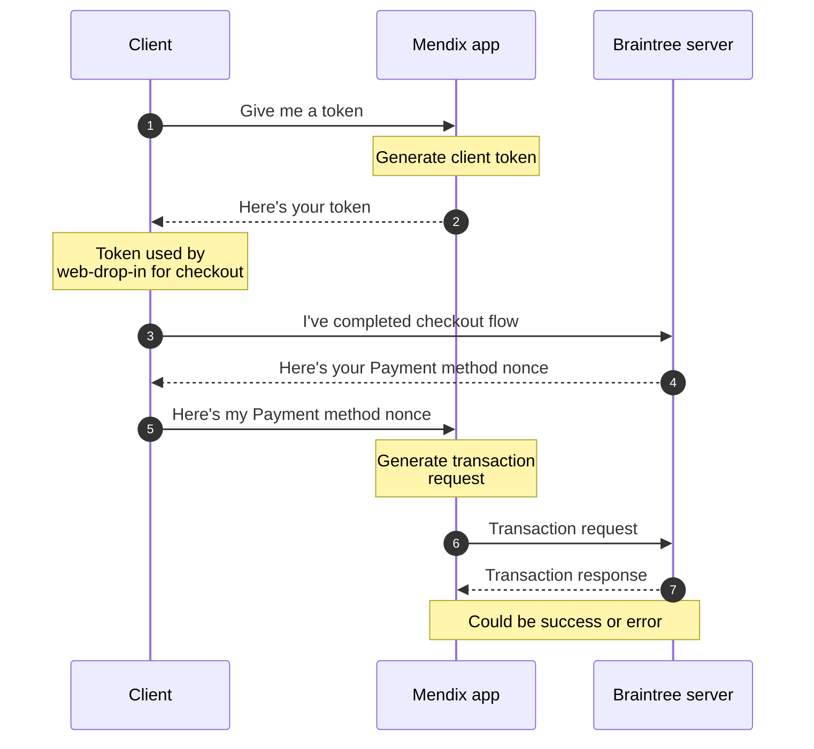

I needed way to accept payments securely in a Mendix app. The [Mendix Marketplace](https://marketplace.mendix.com) *typically* has a solution to your problem - whether it was created by the Mendix team, or by the community; someone has already faced (or is facing) the same problem as you.

In this case, I needed to integrate [Braintree](https://www.braintreepayments.com/gb) - a payment gateway which accepts multiple payment types (Google Pay, Apple Pay, PayPal, Card). Which (at the time) no published content was available on the Mendix Marketplace. This required custom work.

Mendix front-end components (like input box, datalist, drop-down) are called 'Widgets' and are built using React - a JavaScript framework. If you are creating a custom widget, a beginner friendly starting point can easily be generated using the [Mendix Pluggable Widget Generator](https://www.npmjs.com/package/@mendix/generator-widget).

Mendix back-end logic is built using Java. If you want to extend beyond the capabilities of built-in Microflow actions, you need to create a 'Java Action', which is a Java method that can be called from a Microflow.

To fully integrate Braintree payment gateway into our app, I had to implement the front-end [web-drop-in](https://github.com/braintree/braintree-web-drop-in) JavaScript library into a 'Widget' and back-end [Java API](https://github.com/braintree/braintree_java) functionality into a 'Java Action'.

Here is a simple sequence diagram of how the communication between systems works...

Braintree also has a ['How it works'](https://developer.paypal.com/braintree/docs/start/overview#how-it-works) documentation page, which explains it in more detail.

*In the screenshot below, you can see the Braintree drop-in JavaScript library implemented as a Mendix Widget, rendered in an app.*

You can find the source code for the front-end web-drop-in widget in the [Mendix-BraintreeDropIn GitHub repo](https://github.com/shelterbox/Mendix-BraintreeDropIn). Thanks for reading!